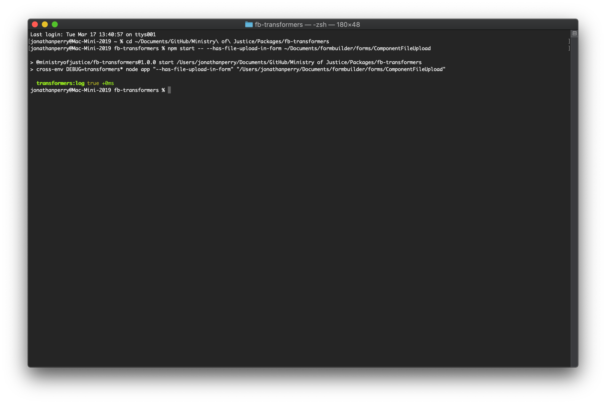
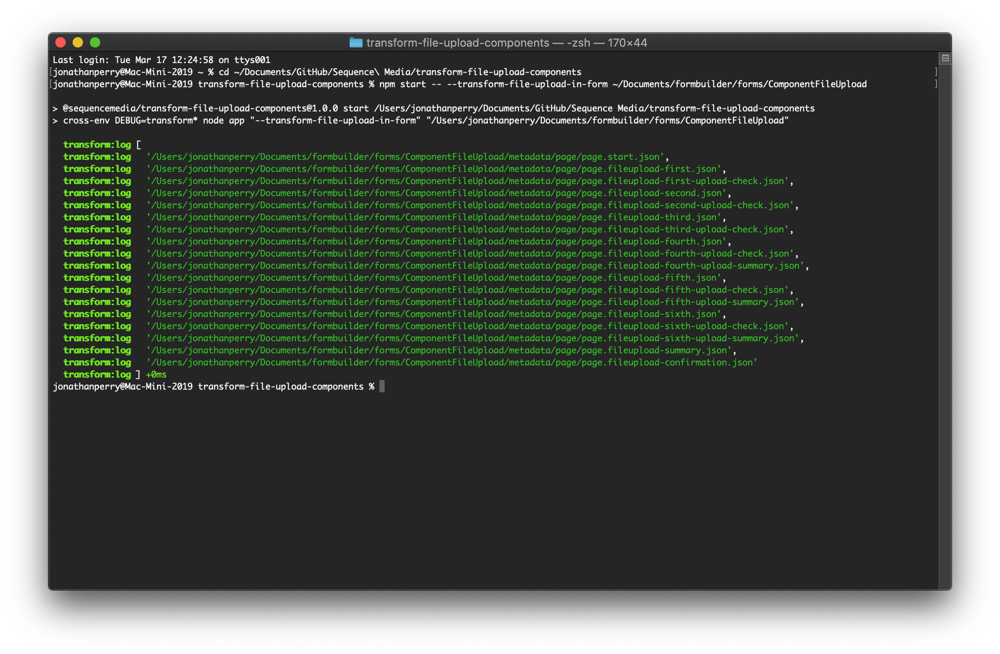
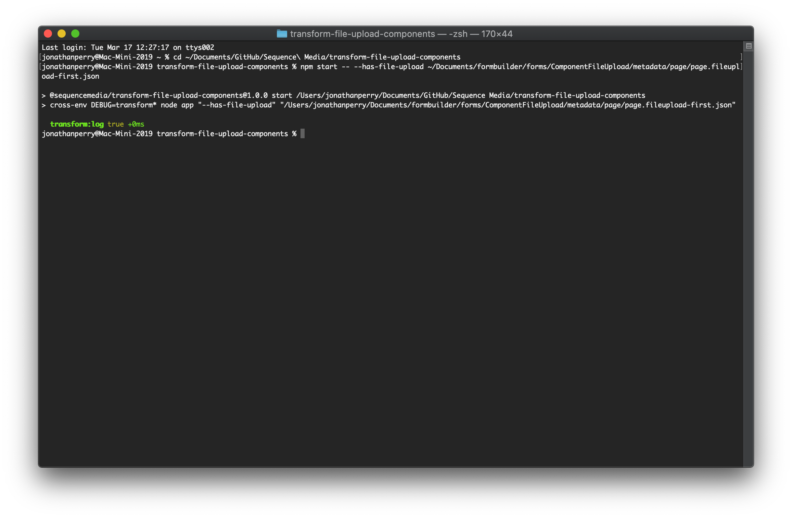
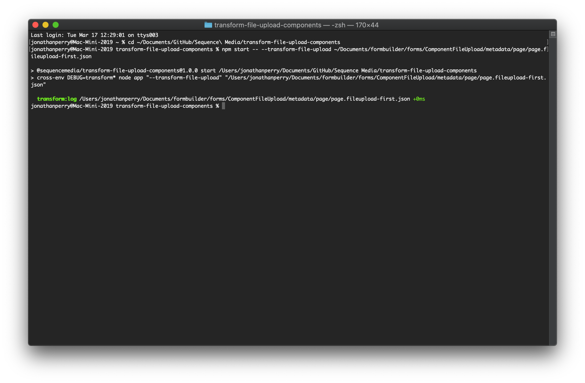
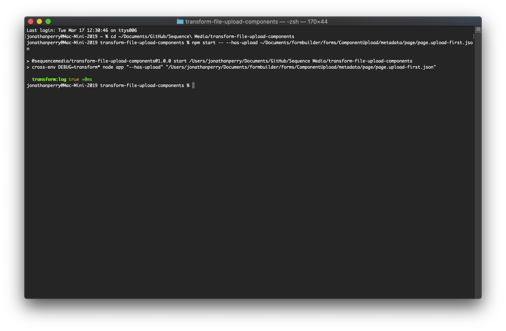
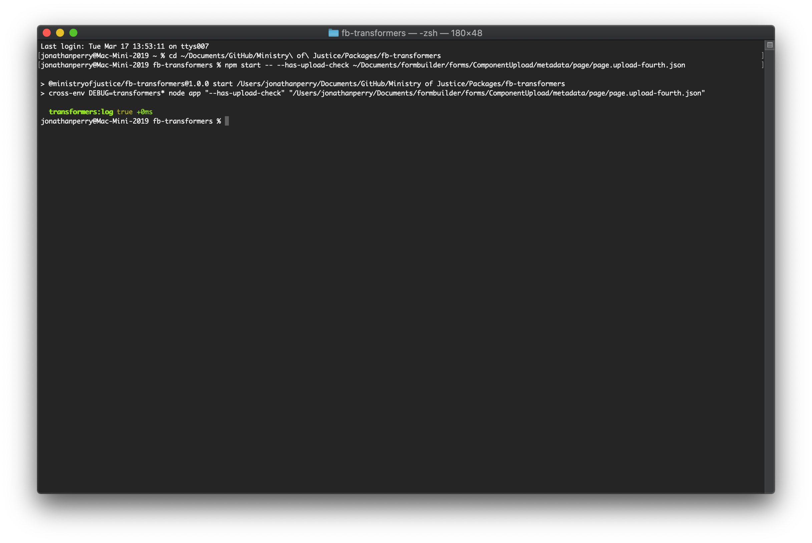
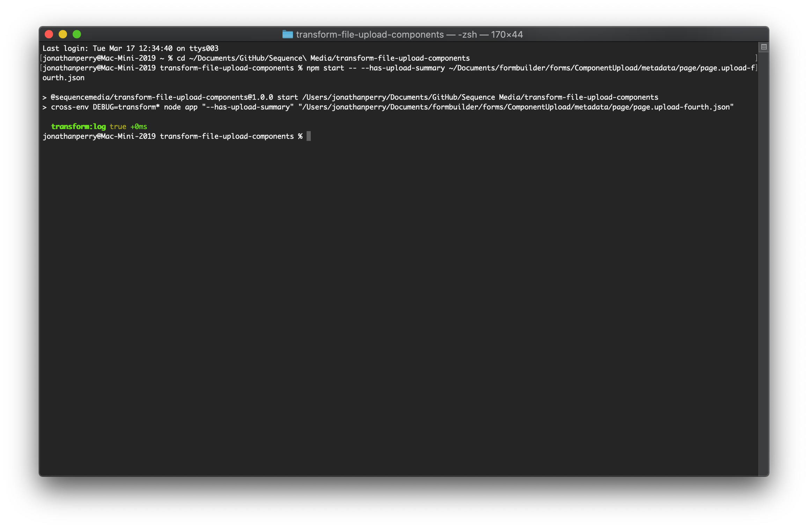

# fb-transformers

Functions in this module transform **Form Builder** `fileupload` components into `upload` components and create any `page.uploadCheck` or `page.uploadSummary` steps, too.

Each of these functions return a `Promise`. The promise can be resolved as part of a chain or using `await`. (The examples below use `await` syntax.)

All of these functions is exposed to the command line with [Commander](https://github.com/tj/commander.js).

## Primary functions

### `hasFileUploadComponentInForm`

Accepts a path to a Form directory as an argument. It walks all the steps and standalone pages looking for `fileupload` component and returns a boolean:

```javascript
const directoryPath = '~/Documents/formbuilder/forms/ComponentFileUpload'

await hasFileUploadComponentInForm(directoryPath) // resolves to a boolean
```

### `transformFileUploadComponentsInForm`

Accepts a path to a Form directory as an argument. It walks all the steps and standalone pages looking for `fileupload` components and returns an array:

```javascript
const directoryPath = '~/Documents/formbuilder/forms/ComponentFileUpload'

await transformFileUploadComponentsInForm(directoryPath) // resolves to an array of strings
```

The resolved array contains a list of all the files that were examined, not all the files that have been changed.

## Secondary functions

These functions are exported from the module and are used internally by the module.

### `hasFileUploadComponent`

Accepts a path to a Form JSON file as an argument. It does not walk -- it is only interested in the properties of that Form step.

```javascript
const filePath = '~/Documents/formbuilder/forms/ComponentFileUpload/metadata/page/page.fileupload.json'

await hasFileUploadComponent(filePath) // resolves to a boolean
```

### `hasUploadComponent`

Accepts a path to a Form JSON file as an argument. As above, it does not walk.

```javascript
const filePath = '~/Documents/formbuilder/forms/ComponentUpload/metadata/page/page.upload.json'

await hasUploadComponent(filePath) // resolves to a boolean
```

### `hasUploadCheckStep`

Accepts a path to a Form JSON file as an argument. As above, it does not walk.

```javascript
const filePath = '~/Documents/formbuilder/forms/ComponentUpload/metadata/page/page.upload.json'

await hasUploadCheckStep(filePath) // resolves to a boolean
```

### `hasUploadSummaryStep`

Accepts a path to a Form JSON file as an argument. As above, it does not walk.

```javascript
const filePath = '~/Documents/formbuilder/forms/ComponentUpload/metadata/page/page.upload.json'

await hasUploadCheckStep(filePath) // resolves to a boolean
```

## Commander and the CLI

These functions are exposed to the command line so that a developer can update a Form cloned to their environment, or run them from the shell in any other environment.

All of these flags should be prefaced with `npm start --`. The double hyphen indicates that subsequent flags should be passed to the command. For example, assuming you have cloned a Form repository named `ComponentFileUpload` to your environment:

```sh
npm start -- --has-file-upload-in-form ~/Documents/formbuilder/forms/ComponentFileUpload
```

This will set the `DEBUG` variable to enable logging in the terminal, and then execute the command:

```sh
node app --has-file-upload-in-form ~/Documents/formbuilder/forms/ComponentFileUpload
```

Simply executing this on its own will invoke the functions silently, which is probably not what you want.

### Flags

Each of these flags should be followed either by the path to a Form, or the path to a step JSON file.

Paths starting with the "~" character will be resolved to the user's home directory. (Paths containing whitespace should be provided in quotes.)

An error will be thrown if a path is not provided.

### `hasFileUploadComponentInForm`

- `-h, --has-file-upload-in-form` _String, path to Form_

Determines whether Form has `fileupload` component(s), invokes `hasFileUploadComponentInForm`:

```sh
npm start -- --has-file-upload-in-form ~/Documents/formbuilder/forms/ComponentFileUpload
```



### `transformFileUploadComponentsInForm`

- `-t, --transform-file-upload-in-form` _String, path to Form_

Transforms `fileupload` component(s) in Form, invokes `transformFileUploadComponentsInForm`:

```sh
npm start -- --transform-file-upload-in-form ~/Documents/formbuilder/forms/ComponentFileUpload
```


### `hasFileUploadComponent`

- `--has-file-upload` _String, path to step_

Determines whether step has `fileupload` components(s), invokes `hasFileUploadComponent`:

```sh
npm start -- --has-file-upload ~/Documents/formbuilder/forms/ComponentFileUpload/metadata/page/page.fileupload.json
```



### `transformFileUploadComponents`

- `--transform-file-upload` _String, path to step_

Transforms `fileupload` components(s) in step_, invokes `transformFileUploadComponents`:

```sh
npm start -- --transform-file-upload ~/Documents/formbuilder/forms/ComponentFileUpload/metadata/page/page.fileupload.json
```



### `hasUploadComponent`

- `--has-upload` _String, path to step_

Determines whether step has `upload` components(s), invokes `hasUploadComponent`:

```sh
npm start -- --has-upload ~/Documents/formbuilder/forms/ComponentUpload/metadata/page/page.upload.json
```



### `hasUploadCheckStep`

- `--has-upload-check` _String, path to step_

Determines whether step has `page.uploadCheck` step, invokes `hasUploadCheckStep`:

```sh
npm start -- --has-upload-check ~/Documents/formbuilder/forms/ComponentUpload/metadata/page/page.upload.json
```


### `hasUploadSummaryStep`

- `--has-upload-summary` _String, path to step_

Determines whether step has `page.uploadSummary` step, invokes `hasUploadSummaryStep`:

```sh
npm start -- --has-upload-summary ~/Documents/formbuilder/forms/ComponentUpload/metadata/page/page.upload.json
```

